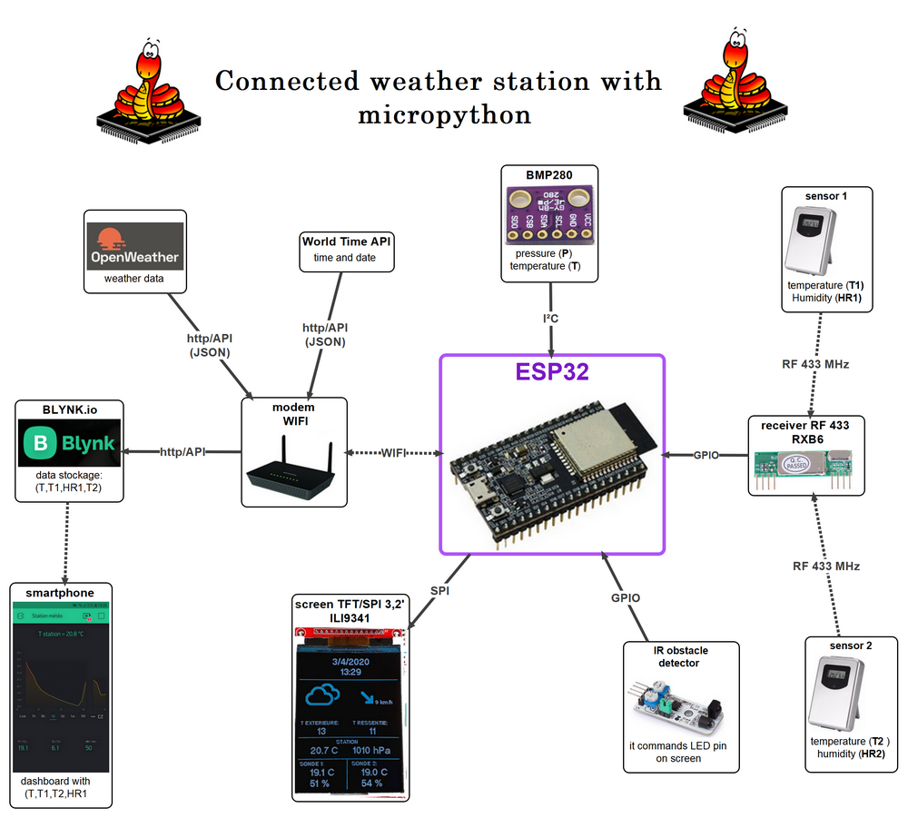
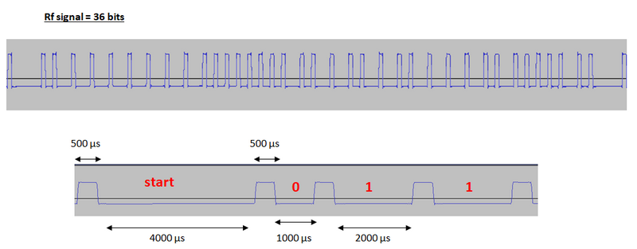
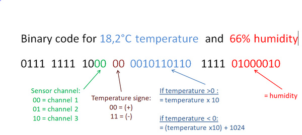
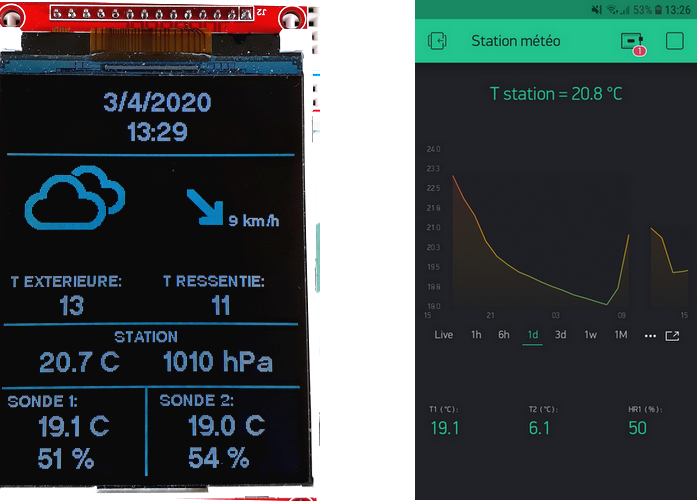

# micropython-connected-weather-station
Connected weather station with: ESP32, micropython, tft spi ili9341 screen, RF 433 Mhz RXB6 reciever, RF 433 Mhz temperature an humidity sensor, Blynk.io, OpenWeathermap, BMP280 ...

## Installation:
* See [Connecting diagram file](version1/Connecting%20diagram.txt)
* Copy all files from *version1* folder to the ESP32 board.
* Paste your OpenWeatherMap API key, Blynk API key, SSID name and Wifi key into data_wifi.py file instead of "..."
* *mesure.py* has to be adapt to your sensor model.

## My sensor Rf signal:

 
  
  
 ## Files explanation:
 ### bmp280.py :
 Library for bmp280 sensor

### data_wifi.py :
Wifi connexion
* get data from OpenWeatherMap an WorldTimeAPI (https://itechnofrance.wordpress.com/2019/04/23/creer-une-station-meteo-sans-capteurs-en-micropython/)
* send data to Blynk.io https://blynkapi.docs.apiary.io/#

### ili934xnew.py : 
Library for ILI9341 screen https://github.com/jeffmer/micropython-ili9341

### tt14.py and tt24.py : 
Fonts fot ili9341 screen

### mesures.py:
* get data from RF sensor
* get data from BMP280

### screen.py:
write on screen

### ICONS:
Folder with text files icons , i use flash memory to store them instead of Ram memory.

### main.py:
main program

### Any questions:
gwendal.boronad@wanadoo.fr
 
 ## Display on screen and smartphone:
  
  
